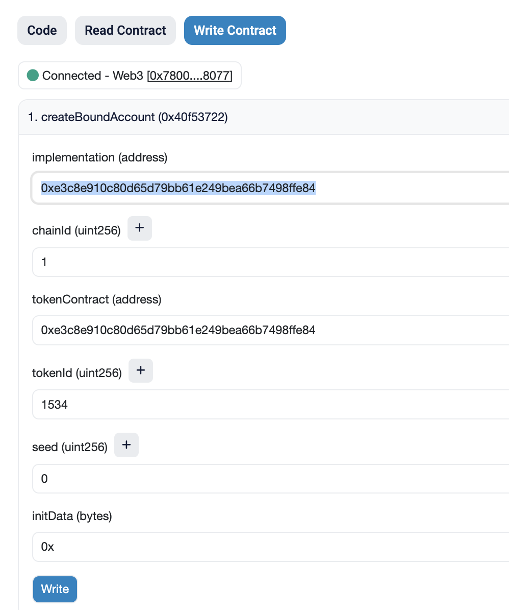
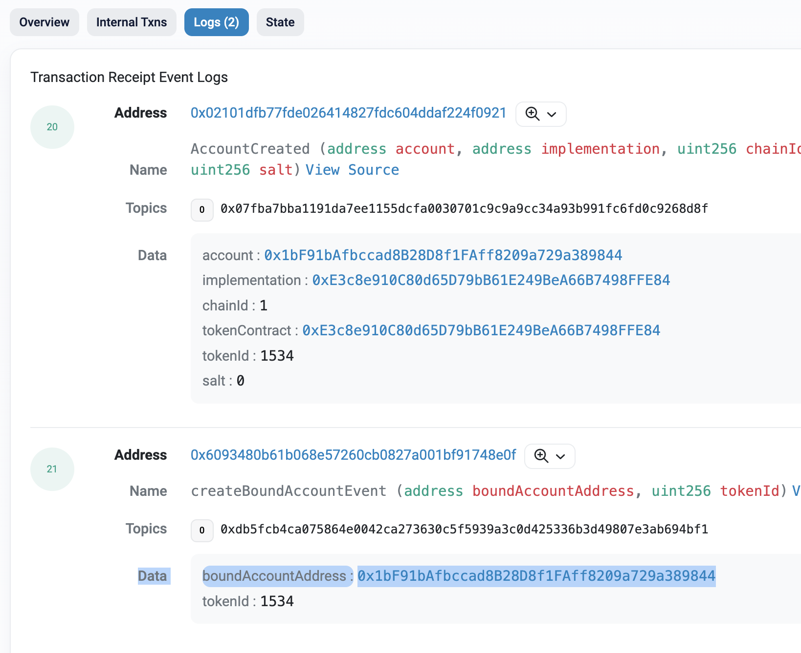
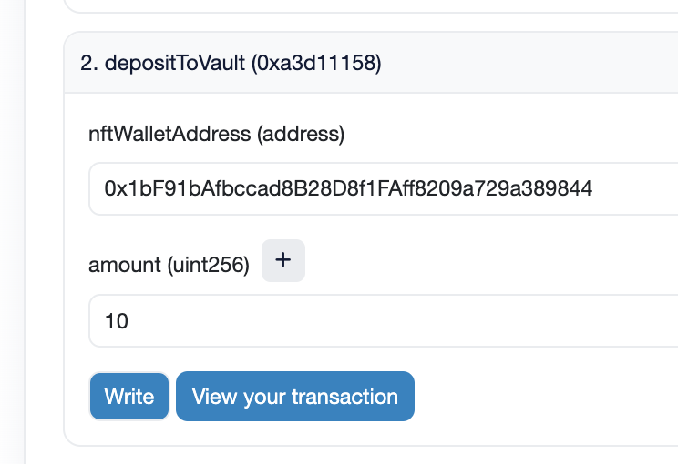
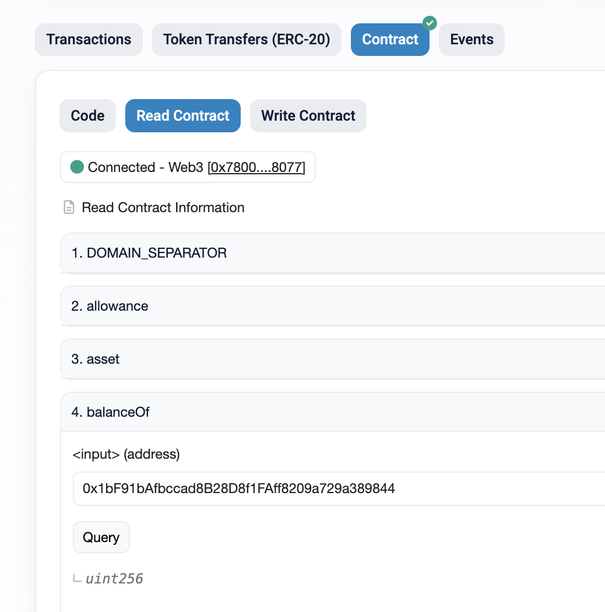
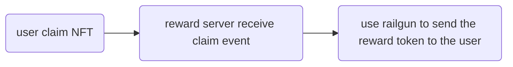

# How to Use David's Janky Contract

## Addresses

```
Deployed mockWEth Address: 0xaeB7E4617dD35C594246f368278b62E1107978dc
Deployed tokenizedVault Address: 0x1Ce2CAfe36c080001Cf92306129bACDF3479dAFd
Deployed surpriseBagNFT Address: 0x6093480B61B068E57260cB0827A001BF91748e0F
```

## Scroll

1. <https://blockscout.scroll.io/address/0x5E8316eC4b05bf64e88F7b90823b269cC50F35b4#code>
2. <https://blockscout.scroll.io/address/0x5fEece051F64c3e371633C18edCf6c4d3C001E86#code>
3. <https://blockscout.scroll.io/address/0x548ea94d8714d4c3d1e7549db7A3889f32AC4b02#code>

## Run

1. 看 test: [./packages/hardhat/test/myTest.js](./packages/hardhat/test/myTest.js)
2. 用 sepolia's etherscan UI
    1. `surpriseBagNFT.createBoundAccount`: 先用 `surpriseBagNFT` (ERC 6551) 建立某個 NFT 的 account
        
    2. Navigate to surpriseBagNFT 的`logs` tab, 你會看到 `boundAccountAddress`, 這就是屬於這個 NFT 的錢包（是個 smart contract），請記下來等等會用到
        
    3. Approve `mockWEth` 讓 `surpriseBagNFT` 使用，因為等等你要把錢存到 NFT 的錢包裡面，這個合約會幫你做。這邊沒有 UI 因為不知為何我一直不能 verify 這隻... 我是廢物，你可以用 [./packages/hardhat/scripts/approve_weth.js](./packages/hardhat/scripts/approve_weth.js) 去 approve, 或是你自己寫 js 在前端 approve
    4. `surpriseBagNFT.depositToVault`: 把 step 2 的 NFT 錢包地址複製到這邊，這個 function 就是把 weth 存到 NFT 的錢包，也就是我們的福袋囉
        
    5. `tokenizedVault.balanceOf`: 這邊可以檢查 NFT 錢包的 vault(erc 4626) 是不是真的有收到剛剛那筆錢，有的話就成功囉
        

### Reward Server

